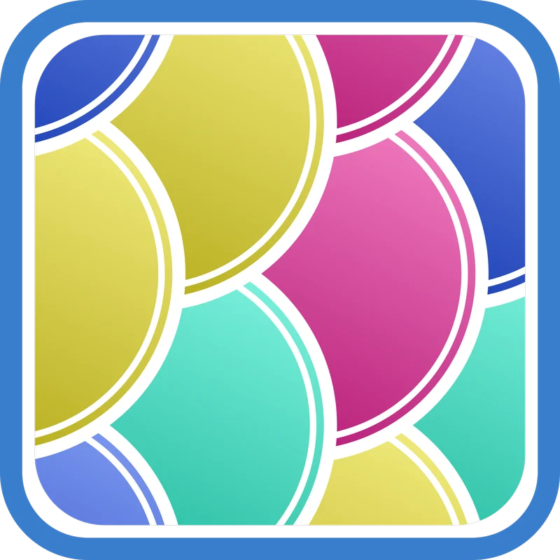

# Koi

> `Comfort Shell Environment` base on [Oh My Fish][omf-link].

[](/LICENSE)
[](https://fishshell.com)
[](https://www.github.com/oh-my-fish/oh-my-fish)

## Plan

- [ ] 对klib支持init.fish载入，并在没有klib的情况下不会报错

## Install

```fish
omf install https://github.com/veeshan-io/koi
```

## Usage

```fish
koi
```

## Features

---

[author]:         https://github.com/veeshan-io
[contributors]:   https://github.com/veeshan-io/koi/graphs/contributors
[omf-link]:       https://www.github.com/oh-my-fish/oh-my-fish
